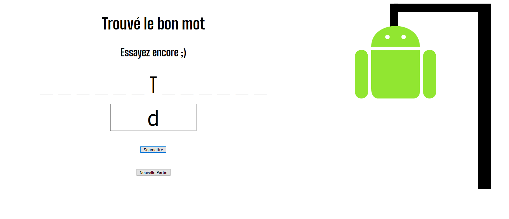

# Le Pendu

Bienvenue sur la page de mon pendu
C'est un programme réaliser en JS dans le cadre de ma formation.

### BONUS
  * Le mot est choisie par un random, parmi plusieurs miliers (fichier JSON).
  * Le pendu est rendu visuellement à l'aide de svg. (pendu ANDROID)
  * Pour les tricheurs...le mot est afficher dans la console aisni que la table de lettre déjà proposé.
